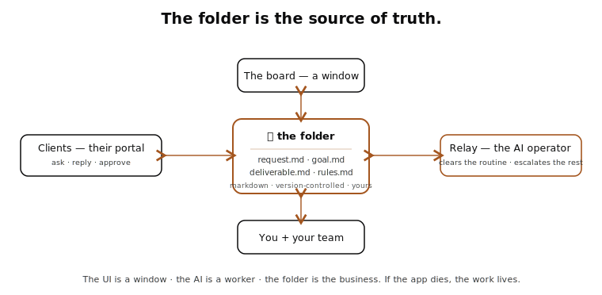

<p align="center">
  
</p>

<p align="center"><strong>Every tool you've tried organizes your work and hands it back to you. Relay finishes it.</strong></p>

<p align="center">
  <a href="https://relay-playroom.vercel.app"></a>
  &nbsp;
  
  &nbsp;
  
</p>

---

Relay is a **folder-based studio operator**. Clients ask in plain language, a small team runs every account from one board, and an AI connected to the same files **completes the routine work and escalates what needs a human**. The board is the work. The files are the truth. If the app dies, the work lives.

It's built with [**Interpretable Context Methodology (ICM)**](#the-methodology--icm): the agent is a folder, and the studio it runs is a folder. The path through the folders *is* the logic.

> **▶ Watch the 90-second demo:** **[relay-playroom.vercel.app](https://relay-playroom.vercel.app)** — it opens with a 60-second pitch, then walks the whole thing, then shows Claude running the folder. No signup.

## Contents
- [The 60-second story](#the-60-second-story)
- [What Relay is](#what-relay-is)
- [How it works](#how-it-works)
- [The folder](#the-folder)
- [Who sees what (the access model)](#who-sees-what-the-access-model)
- [Clients are engagements](#clients-are-engagements)
- [What's real vs. this demo](#whats-real-vs-this-demo)
- [Use the specialist yourself](#use-the-specialist-yourself)
- [Run the demo locally](#run-the-demo-locally)
- [What's in this repo](#whats-in-this-repo)
- [The methodology — ICM](#the-methodology--icm)
- [License](#license)

## The 60-second story
Two people run **eight companies**. Work was scattered across Slack, docs, and eight separate folders — no way to see what was dying or what needed them next. They tried the enterprise-platform trap (role matrices, dashboards) and scrapped it. The real problem was never features — it was **operating discipline**.

So they built the opposite of a platform: a **folder**. Every task, message, decision, and deliverable is a markdown file they own. The board is just a window onto it. An AI reads the same folder and does the routine work. They built it for themselves first — Relay is the demo of that system, on fabricated data.

## What Relay is
- **A board that's really a folder.** Every card is a markdown file (`clients/<slug>/requests/<id>.md`). Move it, complete it, comment on it — the file changes.
- **An AI operator, not a chatbot.** It sorts every request — 🟢 *clear* / 🟡 *hold* / 🔴 *escalate* — does what's routine, writes a completion note, and refuses what it shouldn't touch (publishing, pricing, anything irreversible).
- **Three actors on one board.** Operators (you + your partner), clients (their own scoped portal), and the AI — all editing the same files.
- **Run it two ways.** Work a task by hand (copy the prompt → run it in Claude → paste the note), or hand Claude the whole client folder and it clears the queue autonomously.
- **Run it *live*.** Open any task → **Run live with Claude** → paste your own Anthropic key and real Claude reads the folder and does it (or escalates). Your key, your folder, your data — it stays in your browser and only ever calls Anthropic. This is the app's core loop, working today.

## How it works

<p align="center"></p>

**The folder is the source of truth.** The UI is a window; the AI is a worker; the folder is the business. No database owns your work.

**The Lane Protocol** (`rules.md`, as code) sorts every request:

| Outcome | When | What happens |
|---|---|---|
| 🟢 **Clear** | reversible · unambiguous · in the playbook | do it → write a 3-line completion note → done |
| 🟡 **Hold** | ambiguous / missing info | ask exactly one question, then wait |
| 🔴 **Escalate** | irreversible · money · production · scope · novelty | hand to a human with a recommendation — never attempt |

**Three layers (ICM):** a **Map** (`CLAUDE.md`, always loaded — routing only) → **Rooms** (`CONTEXT.md`, loaded per stage of work) → **Skills** (`SKILL.md`, loaded only when a task needs one). The folder behaves like a deep specialist without ever loading everything.

## The folder
```
relay/
├── brief.md            ← the client brief (start here)
├── identity.md         ← who Relay is
├── rules.md            ← the Lane Protocol + refusal list (the engine)
├── examples.md         ← annotated runs · anti-examples.md
├── CLAUDE.md           ← Layer 1: the map + routing table
├── reference/          ← playbook, lane-protocol, templates, voice
├── rooms/              ← Layer 2: intake · delivery · escalations · standup
├── skills/             ← Layer 3: copy-edit · content-update · seo-meta · …
├── patterns/ · sessions/ · tests/ · working-theory.md
├── studio/             ← a working studio on fabricated data
│   └── clients/<slug>/   card · CONTEXT · STATE · requests/ · deliverables/
└── playroom/           ← the live, deployable demo (Next.js)
```
Every file above is plain markdown you can read, edit, and own.

## Who sees what (the access model)
Access is real and enforced at the database (row-level security) — not a UI trick. Try it in the demo with **View as**.

| | Executive | Member | Client (external) |
|---|---|---|---|
| Their spaces | all + Executive | client spaces only | **their own, only** |
| Board, tasks, replies | ✅ | ✅ | ✅ (their workspace) |
| Run / complete / AI actions | ✅ | ✅ | ❌ (they ask + approve) |
| Cockpit · Analytics · Admin | ✅ | partial | ❌ |
| Sees other clients / Executive | ✅ | ❌ | ❌ |

## Clients are engagements
A client isn't a request inbox — it's a **signed engagement** with a lifecycle: diagnostic intake → tier (Express / Standard / Build / Retainer) → a 7-phase delivery → handoff → retainer. Each client logs into their own portal: **Overview** (phase + next meeting/invoice) · **Board** (open a request, reply to the studio) · **Deliverables** (approve / request changes) · **Files** · **Goals** · **Meetings** (book a Google Meet) · **Billing**.

## What's real vs. this demo
The demo is a faithful, IP-safe **slice** on fabricated data (two clients: Northwind, Acme). The full command center adds the deep backend:

| In the demo | In the full system |
|---|---|
| Fabricated clients + data | Real engagements synced from a live CRM |
| Simulated presence / chat | Supabase Auth + realtime; everyone has a login |
| Lane Protocol runs offline | Claude reads the actual folder (incl. site files) |
| Calendar / Costs / Decisions explained | Google Calendar → billing, Stripe, decision log |
| One studio | Multiple businesses, fully separated by org + RLS |

## Use the specialist yourself
The ICM folder *is* the agent — no install:
1. Drop this folder into a **Claude Project** (or paste the files into a chat). Claude reads `CLAUDE.md → identity.md → rules.md` automatically.
2. Talk to it like an operator or a client: *"change the Northwind headline to mention same-day quotes"* → it CLEARs it; *"push the pricing page live"* → it ESCALATES with a recommendation.
3. Point it at your own studio: copy the `studio/clients/northwind/` shape per real client and add your routine request types to `reference/playbook.md`. No database, no account.

## Run the demo locally
```bash
cd playroom
npm install
npm run dev      # http://localhost:3000
npm run build    # static export → ./out (deploy anywhere)
```
Node 20–24 · Next.js · static export · no backend. See [`playroom/README.md`](playroom/README.md).

## Make it yours
Relay isn't a SaaS you log into — it's *your folder + this app*. The demo is the app on mock data; your version is the same app with your folder dropped in.
1. **Generate your folder** — in the demo, hit **Build your folder**: a 2-minute wizard scaffolds a complete ICM folder (CLAUDE.md, rules.md, a `clients/<you>/` tree…) from your business, your clients, your voice, and your clear-vs-escalate rules → downloads as a `.zip`.
2. **Use it instantly** — drop that folder into a Claude Project and it's your operator, no install.
3. **Or run the full UI** — put the folder in `playroom/studio/`, `npm run dev`, and click **Run live with Claude** with your own key. Same board, your data, your key. It's yours.

## What's in this repo
- **`brief.md`** — the competition brief (treat-yourself-as-the-client).
- **The ICM specialist** — `identity.md`, `rules.md`, `examples.md`, `CLAUDE.md`, `reference/`, `rooms/`, `skills/`, `patterns/`, `tests/`, `studio/`.
- **`playroom/`** — the full Next.js demo (the live site's source).
- **`assets/`** — diagrams.

## The methodology — ICM
Relay is built on **Interpretable Context Methodology**: a folder structure where a `CLAUDE.md` map routes to context "rooms" and reusable "skills," so a plain folder behaves like a deep, auditable specialist. The methodology is shared openly — take the pattern.

## License
**Split:**
- **The methodology** (this ICM folder) is **open** — take the pattern, build your own studio on it.
- **The Relay™ application and brand** (`playroom/` + its code) are **proprietary, evaluation-only** — see [`playroom/LICENSE`](playroom/LICENSE). View it, run it; don't reproduce, rebrand, or commercialize it. The real product stays private.

<p align="center"><sub>Relay™ · © 2026 · a demo of what's possible — not the production product.</sub></p>
